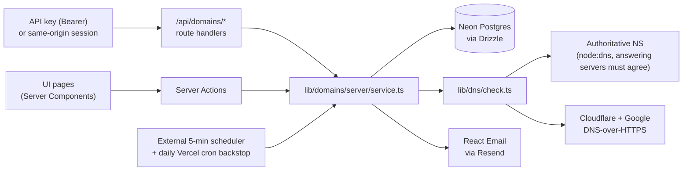

# Domainify

Prove you own a domain, and understand every step of the process.

Domainify is a take-home project for Resend's product engineer challenge: a full-stack
TypeScript app where you add a domain you own, place one DNS TXT record, and watch
verification happen live, with clear diagnostics when something goes wrong and a
guided path to recovery.

Every operation works over two surfaces backed by the same service code: the UI, and a
plain HTTP API you can drive with `curl` (see the [API reference](#api-reference) and
the `</>` panels inside the app).

## How verification works

1. Add a domain. Domainify generates a single-purpose 256-bit token bound to your account.
2. Create a TXT record at `_domainify-challenge.<your-domain>` with the value
   `domainify-domain-verification=<token>`.
3. Domainify queries your domain's **authoritative nameservers** directly (plus
   Cloudflare and Google public resolvers for a propagation view), so a freshly added
   record is detected in seconds, with no "wait up to 48 hours".

The verdict rule requires corroboration: a domain is verified when **every authoritative
nameserver that answers returns the expected value** (up to two are queried, CNAME-chased
up to 8 hops), or when **both public resolvers agree**. A lookup failure (SERVFAIL,
timeout) never demotes a verified domain, because a DNS outage is not evidence the record
was removed.

Domain lifecycle: `pending → verified`, with `temporary_failure` (72-hour grace period,
with an email warning) when a verified record disappears, and `failed` when a window
expires, recoverable via an explicit restart that mints a fresh token.

Every technical choice, and the alternatives it beat, is documented in
[DECISIONS.md](./DECISIONS.md).

## Architecture



One rule keeps the two surfaces honest: Server Actions (UI mutations) and route
handlers (API) are both thin wrappers over `lib/domains/server/service.ts`. There is
exactly one implementation of every operation, so the API can't drift from the UI.

Checks run through a single entry point regardless of trigger: manual button, 30-second
client polling while a page is open, check-on-read when a domain is viewed stale, or the
background sweep with capped-exponential backoff. The sweep runs every 5 minutes from an
external scheduler, with the platform's daily cron as a backstop; each run claims its
batch atomically, so overlapping triggers never check the same domain twice.

## Stack

- Next.js (App Router) on Vercel
- Neon Postgres + Drizzle ORM
- Better Auth password and magic-link sign-in with mandatory email verification, plus
  API keys for the HTTP API and multi-session account switching; emails via Resend +
  React Email
- `node:dns` + DNS-over-HTTPS for lookups, `tldts` for public-suffix validation

Beyond the domain dashboard, the app ships a docs area at `/docs` (verification
mechanics, troubleshooting, and a per-endpoint API reference) and account settings at
`/settings` (API keys, sessions, theme).

## Local development

```bash
pnpm install
cp .env.example .env   # fill in real values
pnpm db:push           # sync schema to your Neon database
pnpm dev
```

Environment variables (see `.env.example`): `DATABASE_URL` (Neon), `BETTER_AUTH_SECRET`,
`BETTER_AUTH_URL`, `RESEND_API_KEY`, `EMAIL_FROM`, `CRON_SECRET`.

```bash
pnpm test              # unit tests (normalization, state machine, record matching, scheduling)
pnpm lint
pnpm build
pnpm typecheck         # not run in CI; `pnpm build` type-checks the app
pnpm email:dev         # preview email templates
```

CI runs `pnpm test`, `pnpm lint`, and `pnpm build` on every push
(`.github/workflows/ci.yml`).

## API reference

### Authentication

The API authenticates with an **API key**, sent as a bearer token. Create one under
Settings → API keys: the key starts with `domainify_`, is shown once at creation, and
acts as the account that created it. New accounts must confirm their email address
before a password sign-in will succeed; the confirmation link is emailed at sign-up and
re-sent on any blocked sign-in attempt.

```bash
export DOMAINIFY_API_KEY='domainify_…'
curl https://<app-url>/api/domains -H "Authorization: Bearer $DOMAINIFY_API_KEY"
```

The browser app authenticates with its own session, so same-origin `fetch` calls from
the app's tab need no key. The `</>` panels inside the app generate ready-to-run curl
and fetch snippets with the header already in place.

Keys are not yet scoped or individually rate limited (see
[Deferred improvements](#deferred-improvements)).

Errors share one shape, `{"error": {"code": "...", "message": "..."}}`, and requests
without a valid API key or session get `401 unauthorized`. Requests for a domain that
doesn't exist *or isn't yours* get the same `404 not_found`; the API never reveals
whether another account holds a domain.

### Endpoints

| Method   | Path                              | Success                                    | Errors |
| -------- | --------------------------------- | ------------------------------------------ | ------ |
| `GET`    | `/api/domains`                    | `200 {domains: [...]}`                     | none |
| `POST`   | `/api/domains`                    | `201 {domain, record}`                     | `422` input, `409 duplicate` |
| `GET`    | `/api/domains/:id`                | `200 {domain, checks, record}`             | `404` |
| `POST`   | `/api/domains/:id/verify`         | `200 {domain, check}`                      | `429 cooldown` (+`retryAfterMs`), `404` |
| `POST`   | `/api/domains/:id/restart`        | `200 {domain}`                             | `409 invalid_state` (only `failed` restarts), `404` |
| `POST`   | `/api/domains/:id/regenerate`     | `200 {domain, record}`                     | `404` |
| `DELETE` | `/api/domains/:id`                | `204` (no body)                            | `404` |
| `GET`    | `/api/cron/revalidate`            | `202 {started}` (sweep runs after the response) | `401` without `Authorization: Bearer <CRON_SECRET>` |

Notes:

- **Create** accepts anything a user might paste: `{"name": "https://www.example.com/pricing"}`
  normalizes to `example.com`. Input error codes: `empty`, `unparseable`, `ip_address`,
  `public_suffix` (e.g. `co.uk`), `platform_suffix` (e.g. `vercel.app`),
  `invalid_hostname`, `invalid_body`. The response carries the TXT record to publish
  alongside the domain, so one call is enough to know what to create.
- **Get** returns the domain, its last 20 checks (with per-source outcomes and TTLs),
  and the exact record to create. Reading a stale domain (last check > 2 minutes ago)
  schedules a fresh check that runs after the response is sent, so the read itself is
  never blocked and the result lands on the next read (or arrives over polling in the
  UI).
- **Verify** runs a live three-source DNS check; one per domain per 5 seconds.
- **Regenerate** rotates the record value; a verified domain returns to `pending` until
  the new record is found.

### Examples

```bash
# Add a domain
curl -X POST https://<app-url>/api/domains \
  -H "Authorization: Bearer $DOMAINIFY_API_KEY" \
  -H 'content-type: application/json' \
  -d '{"name":"example.com"}'
# → 201 {"domain":{"id":"…","hostname":"example.com","status":"pending",…},"record":{…}}

# Trigger a check
curl -X POST https://<app-url>/api/domains/<id>/verify \
  -H "Authorization: Bearer $DOMAINIFY_API_KEY"
# → 200 {"domain":{…,"status":"verified"},"check":{"verdict":"verified","sources":[…]}}
```

## Trying the failure modes

Each diagnostic path can be exercised deliberately:

- **Auto-appended host**: create the TXT record with the *full* challenge host in a
  provider that auto-appends your domain, producing
  `_domainify-challenge.example.com.example.com`. Domainify detects exactly this and
  tells you to shorten the Host field.
- **Wrong value**: put a stale token in the record (e.g. after regenerating).
  The diagnosis shows expected vs. found tails.
- **Record removal after verify**: delete the record from a verified domain, then
  verify: the domain enters the 72-hour grace period and a warning email is sent.
- **Restart from failed**: let the pending window lapse (or hit `restart` on a failed
  domain via curl) to get a fresh token and window.

## Trust & safety

- 256-bit single-purpose tokens per (user, domain): `crypto.randomBytes(32)`,
  base64url, rotated on restart and regenerate.
- No cross-tenant leaks: multiple accounts may claim the same domain concurrently
  (Google's model), duplicate errors are generic, not-found and not-yours are
  indistinguishable, and every query is scoped by the session's user id.
- Verification requires multi-source agreement; SERVFAIL never demotes; DNSSEC is
  inherited from validating resolvers (bogus zones fail closed).
- Better Auth hardening: hashed magic-link tokens, database-backed rate limiting,
  5-minute single-use links, origin checks against `BETTER_AUTH_URL`.
- API keys are stored SHA-256 hashed and shown once; only the first characters are kept
  for display. Session-cookie access to `/api/domains/*` is same-origin only, so another
  site's tab can't ride a signed-in user's cookie.
- Password sign-in is blocked until the address is confirmed, so an unverified sign-up
  never yields a session. Sign-up responses are identical whether or not the address is
  already registered.
- Zod on every input; domains validated before any DNS query; DoH query names
  URL-encoded.
- Manual-verify cooldown per domain; cron behind a bearer secret.
- Lifecycle is notify → grace → demote. Nothing is silently revoked.

## Deferred improvements

Documented, deliberately not built:

- **Scoped API keys and per-key rate limits**: keys ship with full account access and no
  per-key limit. Read-only vs. full-access permissions, plus an explicit request budget
  per key, are the next step.
- **Multi-region check vantage points**: the meaningful version of "regions" for pure
  ownership verification (quorum across network perspectives, the MPIC pattern CAs now
  require). Resend's regions exist because email infrastructure is regional; ours would
  be about corroboration, not data locality.
- **Auto-configure**: Cloudflare OAuth (we already detect the provider from NS
  records) or the Domain Connect standard, writing the TXT record for the user with a
  scoped grant. v1 ships provider detection + deep links instead of a dead button.
- **Webhooks** (`domain.verified`, `domain.failed`) and a durable job queue for
  check scheduling beyond the external 5-minute sweep.

## The whole system on one page

```
DOMAINIFY · one domain in  →  proof that you own it out
one path down the middle, and the same check behind every trigger


  THE MAIN PATH                                               WORTH KNOWING
  ┌────────────────────────────────────────────────────────┐  ┌────────────────────────────────┐
  │ 1 · YOU SIGN IN                                        │  │ TWO SURFACES, ONE SERVICE      │
  │ Better Auth runs password and magic-link sign-in. A    │  │ The dashboard mutates through  │
  │ new password account gets no session until it confirms │  │ Server Actions and the API     │
  │ its address, so an unconfirmed sign-up can never claim │  │ through route handlers, but    │
  │ a domain.                                              │  │ both are thin wrappers over    │
  └────────────────────────────────────────────────────────┘  │ one service module, so the API │
                               │                              │ cannot drift away from the UI. │
                               ▼                              └────────────────────────────────┘
  ┌────────────────────────────────────────────────────────┐
  │ 2 · YOU ADD A DOMAIN YOU OWN                           │
  │ Paste anything a person would paste:                   │
  │ https://www.example.com/pricing becomes example.com.   │
  │ IP addresses, public suffixes such as co.uk and        │  ┌────────────────────────────────┐
  │ platform domains such as vercel.app are refused before │  │ TWO TABLES HOLD EVERYTHING     │
  │ a single DNS query is made.                            │  │ A domain row keeps the         │
  └────────────────────────────────────────────────────────┘  │ hostname, its status, the live │
                               │                              │ token and the deadlines        │
                               ▼                              │ attached to it. A check row is │
  ┌────────────────────────────────────────────────────────┐  │ appended for every single      │
  │ 3 · DOMAINIFY MINTS ONE TOKEN                          │  │ lookup, recording what each    │
  │ 32 random bytes, base64url encoded, tied to this       │  │ source answered and when.      │
  │ account and this domain alone. You have 72 hours to    │  └────────────────────────────────┘
  │ publish it, and rotating it invalidates the old one    │
  │ immediately.                                           │  ┌────────────────────────────────┐
  └────────────────────────────────────────────────────────┘  │ WE ALREADY KNOW YOUR DNS HOST  │
                               │                              │ Your nameservers say who runs  │
                               ▼                              │ your DNS, so the steps use     │
  ┌────────────────────────────────────────────────────────┐  │ that provider's own field      │
  │ 4 · YOU PUBLISH ONE TXT RECORD                         │  │ names, warn you that it will   │
  │ Create _domainify-challenge.<your-domain> holding the  │  │ append your domain, and link   │
  │ value domainify-domain-verification=<token>. That is   │  │ into its dashboard.            │
  │ the whole ask: one record, one value, nothing else to  │  └────────────────────────────────┘
  │ configure.                                             │
  └────────────────────────────────────────────────────────┘
┌──────────────────────────────┤
│                              ▼
│ ┌────────────────────────────────────────────────────────┐  ┌────────────────────────────────┐
│ │ 5 · A CHECK RUNS                                       │  │ FOUR WAYS A CHECK STARTS       │
│ │ One entry point takes the domain and the token it is   │  │ All four end in the same       │
│ │ carrying right now, and turns them into the exact      │  │ function, so a check you       │
│ │ string that has to be in DNS.                          │  │ started by hand and a check    │
│ └────────────────────────────────────────────────────────┘  │ started by a machine are the   │
│                              │                              │ same code:                     │
│                              ▼                              │ · you press Check now, at most │
│ ┌────────────────────────────────────────────────────────┐  │   once every five seconds      │
│ │ 6 · THREE SOURCES ARE ASKED AT ONCE                    │  │ · the page you are watching    │
│ │ Not one resolver, three. Agreement between independent │  │   polls every 30 seconds,      │
│ │ views is what makes the answer trustworthy, and        │  │   backing off when the network │
│ │ disagreement is what makes a useful diagnosis          │  │   misbehaves                   │
│ │ possible.                                              │  │ · reading a domain nobody has  │
│ └────────────────────────────────────────────────────────┘  │   checked in two minutes       │
│                              │                              │   schedules one                │
│                              │                              │ · a sweep every five minutes   │
│                              │                              │   picks up whatever is due     │
│                              │                              └────────────────────────────────┘
│                              │
│                              │
│                ┌─────────────┴─────────────────┬───────────────────────────────┐
│                ▼                               ▼                               ▼
│ ┌────────────────────────────┐  ┌────────────────────────────┐  ┌────────────────────────────┐
│ │ YOUR OWN NAMESERVERS       │  │ CLOUDFLARE, OVER HTTPS     │  │ GOOGLE, OVER HTTPS         │
│ │ Asked directly, up to two  │  │ A DNSSEC-validating view   │  │ A second independent       │
│ │ of them, following CNAME   │  │ of what the rest of the    │  │ network. Two large anycast │
│ │ aliases up to eight hops.  │  │ internet currently sees,   │  │ networks agreeing is this  │
│ │ The only source that can   │  │ over a connection that     │  │ project's small-scale      │
│ │ see a record you created   │  │ cannot be forged,          │  │ stand-in for the           │
│ │ seconds ago, because       │  │ reporting the TTL that     │  │ corroboration from several │
│ │ public caches also         │  │ says how long a stale      │  │ vantage points that        │
│ │ remember that it used to   │  │ answer will linger.        │  │ certificate authorities    │
│ │ be missing.                │  └────────────────────────────┘  │ now require.               │
│ └────────────────────────────┘                                  └────────────────────────────┘
│                └─────────────┬─────────────────┴───────────────────────────────┘
│                              │
│                              ▼
│ ┌────────────────────────────────────────────────────────┐  ┌────────────────────────────────┐
│ │ 7 · A VERDICT IS REACHED                               │  │ WHEN IT IS NOT VERIFIED        │
│ │ Verified when every authoritative nameserver that      │  │ The verdict names the failure, │
│ │ answered returns the expected value, or when both      │  │ and each one gets its own      │
│ │ public resolvers agree. A nameserver that never        │  │ explanation on screen:         │
│ │ answered is silence, not disagreement.                 │  │ · the record is nowhere yet,   │
│ └────────────────────────────────────────────────────────┘  │   so keep waiting              │
│                              │                              │ · your provider doubled the    │
│                              ▼                              │   name and it ended up one     │
│ ┌────────────────────────────────────────────────────────┐  │   level too deep, so shorten   │
│ │ 8 · THE DOMAIN'S STATE MOVES                           │  │   the Host field               │
│ │ Pending becomes verified the moment the record is      │  │ · a Domainify record is there  │
│ │ found. A verified domain whose record disappears drops │  │   but carries an older token,  │
│ │ into a 72-hour grace period instead of being revoked.  │  │   so remove the stale one      │
│ │ A window that runs out ends as failed, and only an     │  │ · nothing could be reached at  │
│ │ explicit restart, with a fresh token, leaves that      │  │   all, which is an outage and  │
│ │ state. A lookup failure never demotes anything,        │  │   never counts against you     │
│ │ because an outage is not evidence that the record was  │  └────────────────────────────────┘
│ │ removed.                                               │
│ └────────────────────────────────────────────────────────┘
│                              │                              ┌────────────────────────────────┐
│                              ▼                              │ WHAT LANDS IN YOUR INBOX       │
│ ┌────────────────────────────────────────────────────────┐  │ Two emails, both sent after    │
│ │ 9 · YOU SEE THE RESULT                                 │  │ the response has already gone  │
│ │ The check is stored with every source it asked, your   │  │ out: one when a domain first   │
│ │ cached domain list is thrown away so the next read is  │  │ verifies, and one when a       │
│ │ fresh, and the page you are looking at picks the       │  │ verified domain loses its      │
│ │ change up on its next poll without you touching        │  │ record, saying exactly when    │
│ │ anything.                                              │  │ the grace period ends.         │
│ └────────────────────────────────────────────────────────┘  └────────────────────────────────┘
│                              │
│                              ▼                              ┌────────────────────────────────┐
│ ┌────────────────────────────────────────────────────────┐  │ HOW OFTEN IT COMES BACK        │
│ │ 10 · THE NEXT CHECK IS SCHEDULED                       │  │ A verified domain is simply    │
│ │ Every domain carries the time it is next due. The      │  │ looked at again once a day.    │
│ │ sweep claims a batch of due domains atomically before  │  │ Everything else backs off      │
│ │ checking them, so two overlapping triggers can never   │  │ gradually, from one minute     │
│ │ check the same domain twice.                           │  │ towards a four-hour ceiling,   │
│ └────────────────────────────────────────────────────────┘  │ so a domain nobody is fixing   │
│                                                             │ stops costing lookups.         │
│                                                             └────────────────────────────────┘
│
└──────────────────────────────┘ and the schedule starts the loop again

  WHAT ALL OF THIS IS EXPOSED THROUGH
  ┌────────────────────────────┐  ┌────────────────────────────┐  ┌────────────────────────────┐
  │ THE DASHBOARD              │  │ THE HTTP API               │  │ THE DOCS AND SETTINGS      │
  │ A domain list you can sort │  │ Every operation the UI     │  │ A docs area covering the   │
  │ and filter, a guided add-  │  │ performs, driven with a    │  │ mechanics, the failure     │
  │ domain flow with a live    │  │ bearer key you create in   │  │ modes and every endpoint,  │
  │ countdown to the next      │  │ settings. Errors share one │  │ plus account settings for  │
  │ check, and a detail page   │  │ shape, and a domain that   │  │ API keys, signed-in        │
  │ showing every source and   │  │ is not yours is            │  │ devices and theme.         │
  │ every earlier attempt.     │  │ indistinguishable from one │  └────────────────────────────┘
  └────────────────────────────┘  │ that does not exist.       │
                                  └────────────────────────────┘

HOW TO READ IT
the spine    the ten steps a domain travels, from signing in to being watched
the right    the context each step needs, and what you are told when it fails
the loop     nothing is one-shot: every finished check schedules the next one
the bottom   the three surfaces all of this is exposed through
```
