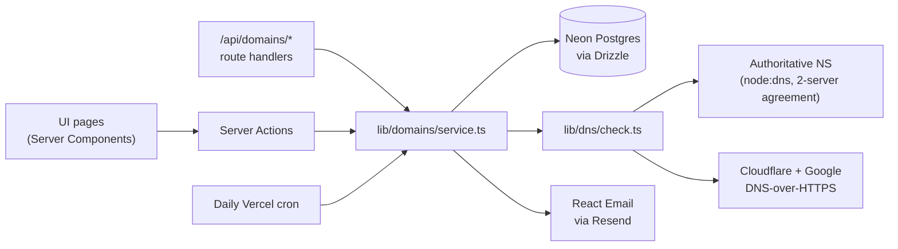

# Domainify

Prove you own a domain — and understand every step of the process.

Domainify is a take-home project for Resend's product engineer challenge: a full-stack
TypeScript app where you add a domain you own, place one DNS TXT record, and watch
verification happen live — with clear diagnostics when something goes wrong and a
guided path to recovery.

Every operation works over two surfaces backed by the same service code: the UI, and a
plain HTTP API you can drive with `curl` (see the [API reference](#api-reference) and
the `</>` panels inside the app).

## How verification works

1. Add a domain. Domainify generates a single-purpose 256-bit token bound to your account.
2. Create a TXT record at `_domainify-challenge.<your-domain>` with the value
   `domainify-domain-verification=<token>`.
3. Domainify queries your domain's **authoritative nameservers** directly (plus
   Cloudflare and Google public resolvers for a propagation view), so a freshly added
   record is detected in seconds — no "wait up to 48 hours".

The verdict rule requires corroboration: a domain is verified when **two distinct
authoritative nameservers agree** (CNAME-chased up to 8 hops), or when **both public
resolvers agree**. A lookup failure (SERVFAIL, timeout) never demotes a verified
domain — a DNS outage is not evidence the record was removed.

Domain lifecycle: `pending → verified`, with `temporary_failure` (72-hour grace period,
with an email warning) when a verified record disappears, and `failed` when a window
expires — recoverable via an explicit restart that mints a fresh token.

Every technical choice — and the alternatives it beat — is documented in
[DECISIONS.md](./DECISIONS.md).

## Architecture



One rule keeps the two surfaces honest: Server Actions (UI mutations) and route
handlers (API) are both thin wrappers over `lib/domains/service.ts`. There is exactly
one implementation of every operation, so the API can't drift from the UI.

Checks run through a single entry point regardless of trigger — manual button, 30-second
client polling while a page is open, check-on-read when a domain is viewed stale, or the
daily cron sweep with capped-exponential backoff.

## Stack

- Next.js (App Router) on Vercel
- Neon Postgres + Drizzle ORM
- Better Auth magic-link sign-in, emails via Resend + React Email
- `node:dns` + DNS-over-HTTPS for lookups, `tldts` for public-suffix validation

## Local development

```bash
pnpm install
cp .env.example .env   # fill in real values
pnpm db:push           # sync schema to your Neon database
pnpm dev
```

Environment variables (see `.env.example`): `DATABASE_URL` (Neon), `BETTER_AUTH_SECRET`,
`BETTER_AUTH_URL`, `RESEND_API_KEY`, `EMAIL_FROM`, `CRON_SECRET`.

```bash
pnpm test              # unit tests (normalization, state machine, record matching, scheduling)
pnpm lint
pnpm email:dev         # preview email templates
```

CI runs the same three commands on every push (`.github/workflows/ci.yml`).

## API reference

### Authentication

The API authenticates with your session cookie. Sign in once in the browser
(magic link), then either:

- **Browser console** — `fetch` calls from the app's own tab send the cookie
  automatically; the `</>` panels in the app generate ready-to-paste snippets.
- **curl** — copy the session cookie from DevTools → Application → Cookies and pass it
  with `-b`. The cookie is `better-auth.session_token` in development and
  `__Secure-better-auth.session_token` in production (https).

```bash
export DOMAINIFY_COOKIE='better-auth.session_token=<value from your browser>'
curl https://<app-url>/api/domains -b "$DOMAINIFY_COOKIE"
```

Real API keys are the documented upgrade path for headless clients (see
[Deferred improvements](#deferred-improvements)).

Errors share one shape — `{"error": {"code": "...", "message": "..."}}` — and requests
without a valid session get `401 unauthorized`. Requests for a domain that doesn't
exist *or isn't yours* get the same `404 not_found`; the API never reveals whether
another account holds a domain.

### Endpoints

| Method   | Path                              | Success                                    | Errors |
| -------- | --------------------------------- | ------------------------------------------ | ------ |
| `GET`    | `/api/domains`                    | `200 {domains: [...]}`                     | — |
| `POST`   | `/api/domains`                    | `201 {domain}`                             | `422` input, `409 duplicate` |
| `GET`    | `/api/domains/:id`                | `200 {domain, checks, record}`             | `404` |
| `POST`   | `/api/domains/:id/verify`         | `200 {domain, check}`                      | `429 cooldown` (+`retryAfterMs`), `404` |
| `POST`   | `/api/domains/:id/restart`        | `200 {domain}`                             | `409 invalid_state` (only `failed` restarts), `404` |
| `POST`   | `/api/domains/:id/regenerate`     | `200 {domain, record}`                     | `404` |
| `DELETE` | `/api/domains/:id`                | `204` (no body)                            | `404` |
| `GET`    | `/api/cron/revalidate`            | `200 {checkedDomains}`                     | `401` without `Authorization: Bearer <CRON_SECRET>` |

Notes:

- **Create** accepts anything a user might paste — `{"name": "https://www.example.com/pricing"}`
  normalizes to `example.com`. Input error codes: `empty`, `unparseable`, `ip_address`,
  `public_suffix` (e.g. `co.uk`), `platform_suffix` (e.g. `vercel.app`),
  `invalid_hostname`, `invalid_body`.
- **Get** returns the domain, its last 20 checks (with per-source outcomes and TTLs),
  and the exact record to create. Reading a stale domain (last check > 2 minutes ago)
  re-checks it inline, so what you read is current.
- **Verify** runs a live three-source DNS check; one per domain per 5 seconds.
- **Regenerate** rotates the record value; a verified domain returns to `pending` until
  the new record is found.

### Examples

```bash
# Add a domain
curl -X POST https://<app-url>/api/domains \
  -b "$DOMAINIFY_COOKIE" \
  -H 'content-type: application/json' \
  -d '{"name":"example.com"}'
# → 201 {"domain":{"id":"…","hostname":"example.com","status":"pending",…}}

# Trigger a check
curl -X POST https://<app-url>/api/domains/<id>/verify -b "$DOMAINIFY_COOKIE"
# → 200 {"domain":{…,"status":"verified"},"check":{"verdict":"verified","sources":[…]}}
```

## Trying the failure modes

Each diagnostic path can be exercised deliberately:

- **Auto-appended host** — create the TXT record with the *full* challenge host in a
  provider that auto-appends your domain, producing
  `_domainify-challenge.example.com.example.com`. Domainify detects exactly this and
  tells you to shorten the Host field.
- **Wrong value** — put a stale token in the record (e.g. after regenerating).
  The diagnosis shows expected vs. found tails.
- **Record removal after verify** — delete the record from a verified domain, then
  verify: the domain enters the 72-hour grace period and a warning email is sent.
- **Restart from failed** — let the pending window lapse (or hit `restart` on a failed
  domain via curl) to get a fresh token and window.

## Trust & safety

- 256-bit single-purpose tokens per (user, domain) — `crypto.randomBytes(32)`,
  base64url — rotated on restart and regenerate.
- No cross-tenant leaks: multiple accounts may claim the same domain concurrently
  (Google's model), duplicate errors are generic, not-found and not-yours are
  indistinguishable, and every query is scoped by the session's user id.
- Verification requires multi-source agreement; SERVFAIL never demotes; DNSSEC is
  inherited from validating resolvers (bogus zones fail closed).
- Better Auth hardening: hashed magic-link tokens, database-backed rate limiting,
  5-minute single-use links, origin checks against `BETTER_AUTH_URL`.
- Zod on every input; domains validated before any DNS query; DoH query names
  URL-encoded.
- Manual-verify cooldown per domain; cron behind a bearer secret.
- Lifecycle is notify → grace → demote. Nothing is silently revoked.

## Deferred improvements

Documented, deliberately not built:

- **API keys** — the API currently rides the session cookie; scoped keys are the real
  answer for headless clients.
- **Multi-region check vantage points** — the meaningful version of "regions" for pure
  ownership verification (quorum across network perspectives, the MPIC pattern CAs now
  require). Resend's regions exist because email infrastructure is regional; ours would
  be about corroboration, not data locality.
- **Auto-configure** — Cloudflare OAuth (we already detect the provider from NS
  records) or the Domain Connect standard, writing the TXT record for the user with a
  scoped grant. v1 ships provider detection + deep links instead of a dead button.
- **Webhooks** (`domain.verified`, `domain.failed`) and a durable job queue for
  check scheduling beyond the daily cron.
